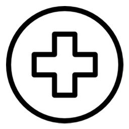

# Система управління клінікою

Десктопний застосунок для Windows, призначений для медичного персоналу. Автоматизація задач лікарів та адміністраторів, пов’язаних з управлінням записами пацієнтів на прийом.

## Огляд

Цей репозиторій містить повний вихідний код дипломного проєкту, структурованого у вигляді рішення Visual Studio. Він включає основну логіку застосунку, компоненти для роботи з базою даних, а також допоміжні скрипти для налаштування проєкту.

Проєкт призначений для академічного оцінювання та демонструє застосування принципів об’єктно-орієнтованого програмування, інтеграцію з базою даних та архітектуру прикладного рівня.

## Технології

- C#
- .NET
- MySQL
- Visual Studio
- MVVM (Model-View-ViewModel)
